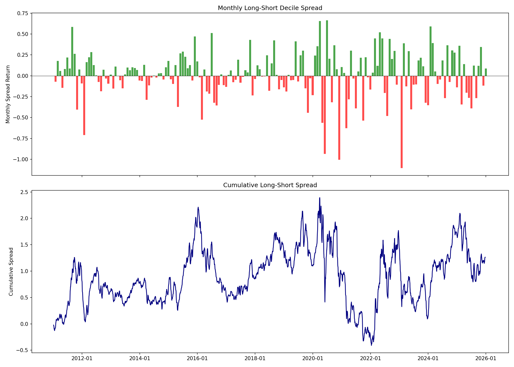
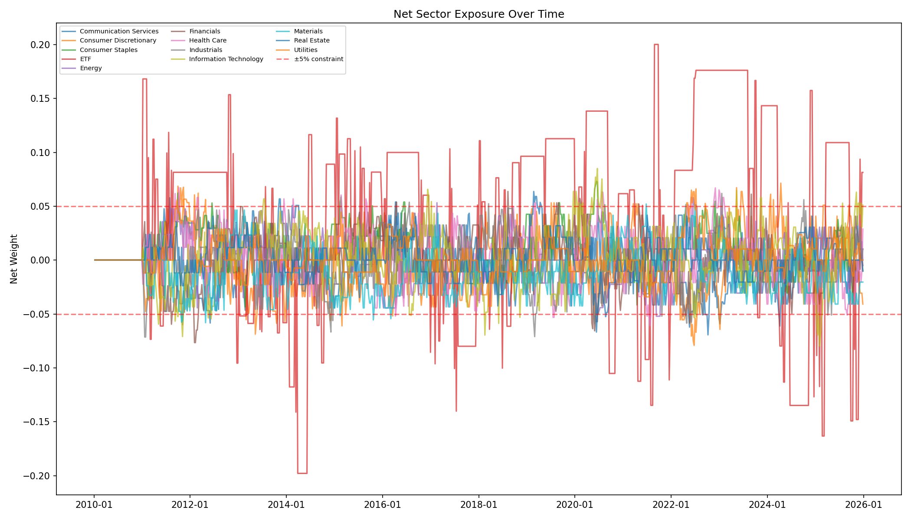

# V2 Diagnostic Report

Generated: 2026-04-16 10:07

## Summary Metrics

- **Gross Sharpe:** 0.307
- **Net Sharpe:** -0.103
- **Net Max DD:** -0.2223
- **Cost drag (bps/yr):** 195.8
  - Commission: 107.0
  - Slippage: 83.4
  - Borrow: 2.6
  - Impact: 2.8

## Per-Signal Standalone Performance

| Signal | Net Sharpe | Gross Sharpe | Max DD | Beta | Decile Spread | Diagnosis |
|--------|-----------|-------------|--------|------|---------------|-----------|
| momentum_12_1 | -0.009 | +0.346 | -25.19% | -0.0041 | +12.25% | NOISE |
| momentum_6_1 | -0.322 | +0.062 | -26.83% | -0.0107 | +10.41% | NOISE |
| reversal_1w | -0.777 | -0.023 | -27.19% | -0.0039 | +2.65% | NOISE |
| low_vol | -0.083 | +0.336 | -21.86% | +0.0420 | +14.83% | NOISE |

## Long vs Short Book Attribution

- **Long-only Sharpe:** 0.801
- **Short-only Sharpe:** 0.484
- **Long contribution (ann):** +5.10%
- **Short contribution (ann):** -3.57%
- **Short borrow cost (ann):** +0.03%
- **Short NET contribution:** -3.60%

> **RECOMMENDATION:** Short book is net-negative after costs. Consider switching to long-extension mode (long top decile + short SPY as single hedge).

## Decile Spread

- **Annualized spread:** 0.0174
- **Months with negative spread:** 0.472

## Sector Drift

## Window 3 Deep-Dive

- **Period:** 2022-12-27 to 2023-12-27
- **Mag 7 in top decile:** 
- **Mag 7 MISSING:** AAPL, MSFT, NVDA, GOOGL, META, AMZN, TSLA

> **FINDING:** Mag 7 stocks were not in the top decile entering 2023. Classic 12-1 momentum lagged because these stocks had poor 2022 returns. This is the primary driver of Window 3 failure.

## Key Recommendations

1. **Drop noise signals:** momentum_12_1, momentum_6_1, reversal_1w, low_vol have net Sharpe < 0.1 — they're adding noise, not alpha.
2. **Switch to long-extension mode:** Short book costs exceed short alpha. Long top decile at 130%, short SPY at 30% as hedge.
3. **Add residual momentum:** Regress out market beta before computing momentum. This avoids the 'just picking high-beta losers' problem.
